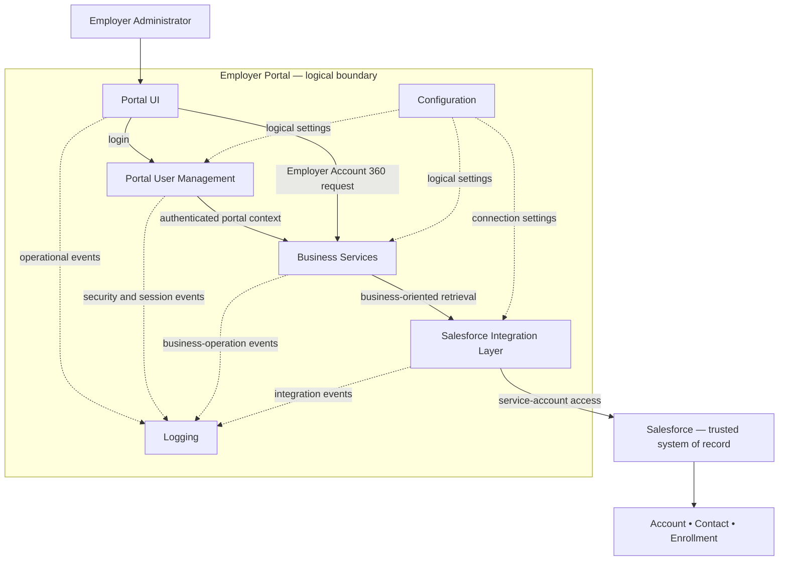

# Solution Architecture — Employer Account Portal

**Showcase:** WorkflowFox Showcase #2  
**Phase:** 4 — Solution Architecture  
**Status:** Approved  
**Architecture level:** Logical enterprise architecture  
**Authoritative baselines:** [Business Discovery](../discovery/01-business-discovery.md), [Functional Requirements](../requirements/02-functional-requirements.md), and [Domain Model](../domain-model/03-domain-model.md)  
**Scope:** Employer Account 360 read-only MVP

## 1. Executive Summary

The Employer Account Portal is a modern external application that provides one read-only Employer Account 360 experience while Salesforce remains the trusted system of record for Employer Account, Employer Contact, and Enrollment information.

The Employer Portal owns its users, username/password authentication, and portal sessions. Each portal user has a stable unique identifier that correlates to exactly one Salesforce Contact, and that Contact belongs to exactly one Salesforce Account for the MVP. The portal user is neither a Salesforce User nor a holder of a Salesforce end-user license.

Business Services coordinate the Employer Account 360 use case using business language. A dedicated Salesforce Integration Layer contains Salesforce-specific knowledge and accesses Salesforce with a service account. The authenticated Employer Administrator never connects to Salesforce and no portal-user credential is passed to Salesforce.

This separation demonstrates the core modernization thesis:

> Modernize around trusted enterprise systems, not necessarily away from them.

The architecture preserves Salesforce data ownership while preventing Salesforce objects, query mechanisms, credentials, and platform interfaces from shaping the Portal UI or business-service boundary. The same logical architecture can therefore be retained if a different enterprise system later becomes the trusted source.

## 2. Architectural Goals

| ID | Goal | Architectural response |
|---|---|---|
| AG-001 | Deliver a modern experience outside Salesforce. | Place the Employer Portal and its user experience outside the system of record. |
| AG-002 | Preserve Salesforce as the trusted source. | Retrieve Account, Contact, and Enrollment information from Salesforce without transferring authoritative ownership to the portal. |
| AG-003 | Keep the MVP read-only and intentionally small. | Support only login and Employer Account 360 viewing; provide no mutation or additional business workflow. |
| AG-004 | Separate external identity from Salesforce identity. | Authenticate portal-managed users and correlate each user to a Salesforce Contact without making that person a Salesforce User. |
| AG-005 | Protect business logic from platform coupling. | Place Salesforce-specific behavior behind a dedicated Integration Layer and expose business-oriented capabilities to the rest of the portal. |
| AG-006 | Preserve portability. | Keep presentation, user management, and business orchestration independent of the current enterprise platform. |
| AG-007 | Support validation and operational trust. | Include logical logging and configuration responsibilities without defining their implementation. |

**Traceability:** Business Discovery §§2–3, 5, 7–12; Functional Requirements FR-001–FR-012 and SC-001–SC-006; Domain Model BR-001–BR-015.

## 3. Architecture Principles

1. **Business capability first.** The architecture exists to support one capability: View Employer Account 360.
2. **Trusted-source preservation.** Salesforce remains authoritative for Employer Account, Employer Contact, and Enrollment data.
3. **Portal-owned identity.** Portal users, credentials, authentication, and sessions belong to the Employer Portal, not Salesforce.
4. **Least knowledge between layers.** The Portal UI knows portal-facing business information; Business Services know domain concepts and rules; only the Integration Layer knows Salesforce representations.
5. **Business-oriented boundaries.** Logical interactions use terms such as Employer Account 360, Employer Contact, and Enrollment Summary rather than source-object or query terminology.
6. **Read-only by design.** No logical component provides a business capability to create, update, submit, or delete Account, Contact, or Enrollment information.
7. **Server-side enterprise access.** Salesforce access occurs through the Integration Layer using a dedicated service account; browser and end-user credentials never connect directly to Salesforce.
8. **Clear ownership.** The portal owns portal identity and sessions; Salesforce owns the authoritative employer business records; derived summaries have no independent source of truth.
9. **Platform isolation.** Changes to Salesforce connectivity or source mappings are contained within the integration boundary as far as the approved business contract permits.
10. **Technology neutrality.** Logical responsibilities do not select frameworks, protocols, products, cloud services, or deployment models.
11. **Observable without exposing sensitive data.** Logical components emit useful operational events, while passwords, sessions, service credentials, and unnecessary business data are excluded from logs.
12. **Configuration outside business logic.** Environment-dependent settings are logically separated from business rules; the protection mechanism for sensitive configuration is deferred to Security Design.

## 4. Logical Architecture Overview

The following diagram shows logical responsibilities and allowed dependencies. It is not a deployment, network, runtime-process, or infrastructure diagram.



### 4.1 Dependency direction

- The Employer Administrator interacts only with the Portal UI.
- The Portal UI delegates authentication to Portal User Management and Employer Account 360 behavior to Business Services.
- Business Services depend on business-oriented integration capabilities, not Salesforce objects or source interfaces.
- The Salesforce Integration Layer depends on Salesforce and translates between domain concepts and source representations.
- Salesforce remains outside the Employer Portal trust and ownership boundary.
- Logging receives operational events; it does not participate in business decisions.
- Configuration supplies settings; it does not contain business rules.

### 4.2 Trust boundaries

1. **User-to-portal boundary:** untrusted login input enters Portal User Management and must be authenticated before employer information is available.
2. **Portal session boundary:** authenticated portal identity and the authorized employer context govern calls to Business Services.
3. **Portal-to-Salesforce boundary:** only the Integration Layer crosses this boundary, using the service account rather than the Employer Administrator's identity.
4. **Source-data boundary:** Salesforce remains authoritative; the portal consumes and composes information but does not become its master.

The controls that enforce these boundaries belong to Security Design. This phase establishes where the boundaries exist and which responsibilities cross them.

## 5. Logical Components

### 5.1 Portal UI

**Responsibilities**

- Collect the Employer Administrator's username and password for portal authentication.
- Present the authenticated, read-only Employer Account 360 experience.
- Present approved Employer Account, Employer Contact, Enrollment Record, and Enrollment Summary information.
- Represent available, empty, unavailable, and unauthorized outcomes using business-safe information supplied by the logical services.
- Avoid exposing source-platform details or credentials.

**Does not own**

- User credential verification, session rules, business authorization, Enrollment calculations, Salesforce access, or authoritative employer data.

### 5.2 Portal User Management

**Responsibilities**

- Own the small set of sample portal-user identities used by the MVP.
- Authenticate username/password credentials owned by the portal.
- Store passwords only in a protected, non-recoverable form; the mechanism and parameters are deferred to Security Design.
- Provide a stable portal-user identity and the stable correlation identifier that maps the user to exactly one Salesforce Contact.
- Establish and validate the logical portal session.
- Supply the authenticated user context needed by Business Services.

**Does not own**

- Salesforce authentication for the end user, Salesforce User accounts, Salesforce business records, or multi-employer access.

### 5.3 Business Services

**Responsibilities**

- Represent the View Employer Account 360 business capability.
- Require an authenticated portal context before processing the use case.
- Coordinate resolution of the authorized Employer Account through the user's Contact correlation.
- Request the approved Employer Account, associated Contacts, and Enrollment Records through business-oriented integration capabilities.
- Derive Total, Active, Pending, and Terminated Enrollment counts from the authorized Enrollment collection.
- Compose Employer Account 360 and preserve the distinction between empty, unavailable, and unauthorized states.
- Enforce the read-only business boundary.

**Does not own**

- Presentation behavior, credential verification, Salesforce queries or source-object names, authoritative employer data, interface contracts, or persistence design.

### 5.4 Salesforce Integration Layer

**Responsibilities**

- Be the only logical portal component that knows Salesforce source representations and connectivity concerns.
- Authenticate portal-to-Salesforce communication using the dedicated service account.
- Resolve the Salesforce Contact matching the portal user's stable correlation identifier.
- Resolve the single Salesforce Account belonging to that Contact.
- Retrieve the approved Account fields, associated Contacts, and associated Enrollment custom-object records.
- Translate Salesforce-specific representations into the domain information expected by Business Services.
- Translate source authentication, connectivity, timeout, source-error, and invalid-response conditions into a platform-neutral unavailable outcome.
- Prevent Salesforce implementation details from crossing into the Portal UI or business-service boundary.

**Does not own**

- Portal authentication, portal sessions, business orchestration, Enrollment summary rules, user presentation, or authoritative Salesforce data.

### 5.5 Salesforce

**Responsibilities**

- Remain the trusted system of record for Employer Account, Employer Contact, and Enrollment data.
- Maintain the approved relationships: one mapped Contact belongs to one Account; displayed Contacts and Enrollment Records belong to the authorized Account.
- Provide the approved MVP information to the Integration Layer under the service account's authorized access.

**Does not own**

- Portal users, portal passwords, portal sessions, portal authentication, the Portal UI, or the composed Employer Account 360 experience.

### 5.6 Logging

**Responsibilities**

- Receive operational events from Portal UI, Portal User Management, Business Services, and the Integration Layer.
- Support diagnosis of authentication outcomes, authorization failures, business-flow completion, unavailable source information, and Salesforce integration failures.
- Preserve correlation across one Employer Account 360 operation using non-sensitive identifiers suitable for later validation.
- Exclude plaintext passwords, session secrets, Salesforce service credentials, and unnecessary personal or business data.

**Does not define**

- A logging product, destination, schema, retention period, audit policy, monitoring platform, or infrastructure.

### 5.7 Configuration

**Responsibilities**

- Provide logical settings required by Portal User Management, Business Services, and the Integration Layer.
- Separate environment-dependent values from business rules.
- Represent references to protected credentials without defining how secrets are stored or delivered.
- Support replacement of Salesforce-specific settings without changing Portal UI or Business Services responsibilities.

**Does not define**

- Configuration file formats, secret stores, environment layout, deployment values, infrastructure, or credential-handling mechanisms.

## 6. Authentication Flow

```text
Employer Login
      ↓
Portal Authentication
      ↓
Portal Session
      ↓
Business Services
      ↓
Salesforce Integration Layer
      ↓ uses dedicated service account
Salesforce
```

1. The Employer Administrator submits a portal username and password to Portal User Management.
2. Portal User Management validates the credentials against the portal-owned sample user identity.
3. Successful authentication establishes a portal session containing or referencing the stable portal-user identity. The session mechanism is deferred.
4. Business Services accept Employer Account 360 requests only within a valid authenticated portal context.
5. Business Services pass the stable user-to-Contact correlation value to the business-oriented integration boundary as part of resolving the authorized employer context.
6. The Salesforce Integration Layer authenticates to Salesforce using the dedicated service account.
7. The Integration Layer uses the correlation to resolve the one Salesforce Contact and that Contact's one Salesforce Account.
8. Subsequent Salesforce retrieval occurs under the service account while remaining constrained to the resolved employer context.

### 6.1 Why Employer Administrators do not require Salesforce licenses

- The Employer Administrator authenticates to the Employer Portal, not Salesforce.
- Portal credentials and sessions are created and validated by Portal User Management.
- The mapped Salesforce Contact is a business record, not a Salesforce User identity.
- The Employer Administrator's browser and credentials never connect to Salesforce.
- All portal-to-Salesforce access uses the dedicated service account through the Integration Layer.

Therefore, Employer Administrators are not modeled as Salesforce Users and do not authenticate to Salesforce. The MVP does not require a Salesforce end-user identity for each portal user. The dedicated service account is the Salesforce identity used by the application; its exact Salesforce license, entitlement, permissions, and authentication mechanism must be validated for the target Salesforce environment during Security Design and implementation planning.

## 7. Data Ownership

| Information | Logical owner / authority | Architecture implication |
|---|---|---|
| Portal Users | Employer Portal / Portal User Management | Usernames, protected password representations, stable portal-user identifiers, and Contact-correlation values are not mastered in Salesforce. |
| Employer Account | Salesforce | The portal may retrieve and present approved fields but does not authoritatively create or change them. |
| Employer Contacts | Salesforce | Contact identity, approved fields, and Account association remain authoritative in Salesforce. |
| Enrollment | Salesforce | Enrollment custom-object records and statuses remain authoritative in Salesforce. |
| Enrollment Summary | Derived by Business Services from Salesforce Enrollment Records | It has no independent owner or record of authority; it must reconcile to the retrieved in-scope records and approved rules. |
| Portal Session | Employer Portal / Portal User Management | Salesforce does not authenticate, create, or validate the Employer Administrator's portal session. |
| User-to-Contact correlation | Split responsibility | The portal user holds the stable correlation value; the matching Contact representation is authoritative in Salesforce. Uniqueness must hold on both sides. |
| Configuration | Employer Portal | Application settings are portal operational information, not Salesforce business data. Sensitive-value protection is deferred to Security Design. |
| Operational logs | Employer Portal / Logging | Logs are operational evidence, not a source of truth for employer business data. |

This ownership model does not authorize broad data replication. Transient processing, caching, and physical persistence are implementation and data-design decisions for later phases.

## 8. Business Flow

| Step | Business flow | Logical responsibility | Result |
|---|---|---|---|
| 1 | Login | Portal UI and Portal User Management | Credentials are validated by the portal. |
| 2 | Resolve Portal User | Portal User Management | The stable portal-user identity and Contact-correlation value are established. |
| 3 | Establish Portal Session | Portal User Management | An authenticated portal context is available to Business Services. |
| 4 | Determine Salesforce Contact | Salesforce Integration Layer, invoked through Business Services | Exactly one matching Salesforce Contact is resolved using the stable correlation identifier. |
| 5 | Determine Employer Account | Salesforce Integration Layer | The Contact's exactly one Salesforce Account establishes the Authorized Employer Context. |
| 6 | Retrieve Account | Salesforce Integration Layer | Employer Name, Employer/Group ID, Status, and Industry are translated to the Employer Account business concept. |
| 7 | Retrieve Contacts | Salesforce Integration Layer | Associated Contacts for the authorized Account are translated using the approved fields. |
| 8 | Retrieve Enrollment | Salesforce Integration Layer | Associated Enrollment Records are translated using the approved showcase fields and statuses. |
| 9 | Compose Enrollment Summary | Business Services | Total, Active, Pending, and Terminated counts are derived only from the authorized Enrollment collection. |
| 10 | Compose Employer Account 360 | Business Services | Account, Contacts, Enrollment Records, summary, and applicable information states form one read-only result. |
| 11 | Return Portal View | Business Services and Portal UI | The business result is presented without Salesforce implementation details. |

### 8.1 Alternate outcomes

- If authentication fails, no portal session or employer information is produced.
- If the correlation resolves to no Contact, more than one Contact, no Account, or more than one Account, the authorized context cannot be established and no employer data is presented.
- A successfully retrieved empty Contact or Enrollment collection is represented as empty.
- If source information cannot be reliably retrieved or validated, it is unavailable rather than empty and the approved business-safe exception message applies.
- The architecture does not decide whether unaffected sections remain visible during a partial failure; that behavior requires later approved design because FR-009 permits but does not require it.
- No alternate outcome creates, updates, submits, or deletes Salesforce business data.

## 9. Architectural Decisions

| ID | Decision | Reason | Trade-off | Alternative considered |
|---|---|---|---|---|
| AD-001 | The Employer Portal owns portal-user authentication and sessions. | Portal users are external users and must not depend on Salesforce identity or licensing. | The portal assumes responsibility for credential and session security. | Authenticate Employer Administrators directly with Salesforce; rejected because it couples the experience to Salesforce users and licensing. |
| AD-002 | Each portal user correlates through a stable identifier to exactly one Salesforce Contact, whose Account determines the employer context. | It creates a simple, traceable MVP authorization relationship consistent with the approved Domain Model. | Correlation integrity becomes critical; missing or duplicate matches prevent access. | Store an independently selected Account directly on the session; rejected because it bypasses the approved user → Contact → Account relationship. |
| AD-003 | Salesforce access uses a dedicated service account through the Integration Layer. | Employer Administrators never need Salesforce credentials or direct connectivity. | The service account is a privileged shared dependency requiring careful permissions, credential protection, and operational control. | Delegate each end user's Salesforce identity; rejected because users are not Salesforce Users and should not require Salesforce licenses. |
| AD-004 | Presentation, user management, business services, and Salesforce integration are separate logical responsibilities. | Separation keeps UI, identity, domain behavior, and platform knowledge independently understandable and testable. | Additional boundaries create more contracts and coordination than a single undifferentiated portal. | Combine all responsibilities in the UI or one platform-specific module; rejected because it increases coupling and weakens validation. |
| AD-005 | Business Services expose Employer Account 360 capabilities in domain language. | The approved requirements prohibit frontend knowledge of Salesforce objects and interfaces. | Translation is required between domain and Salesforce representations. | Expose Salesforce-shaped data to the frontend; rejected because it leaks platform details and reduces portability. |
| AD-006 | Salesforce remains authoritative; the portal composes but does not master employer business data. | The modernization goal is to improve experience without replacing the trusted platform. | Portal availability and freshness depend on Salesforce and the integration path. | Copy employer data into a new portal-owned source of truth; rejected because it duplicates ownership and exceeds MVP scope. |
| AD-007 | Business Services derive the Enrollment Summary from the authorized Enrollment collection. | The summary is a domain rule and not an independently mastered Salesforce entity. | Summary logic must be reconciled to the retrieved record set and maintained if approved rules change. | Make the UI or Salesforce Integration Layer own summary calculation; rejected because presentation should not own business rules and integration should remain focused on source translation. |
| AD-008 | Logging and Configuration are cross-cutting logical capabilities with constrained responsibilities. | Operational validation requires evidence, and environment-dependent values must remain outside business logic. | They introduce governance questions for sensitive data, retention, and change control. | Embed logging and settings independently inside each component; rejected because behavior would become inconsistent and harder to govern. |

These decisions establish logical boundaries only. They do not select interface styles, protocols, frameworks, storage technologies, infrastructure, or deployment topology.

## 10. Non-Goals

This architecture does not define or introduce:

- enrollment submission, document handling, billing, invoices, payments, claims, case management, notifications, workflows, autonomous agents, or chatbots;
- Account, Contact, or Enrollment creation, update, or deletion;
- additional employer self-service or multi-employer account switching;
- direct browser or Employer Administrator access to Salesforce;
- Salesforce User accounts for Employer Administrators;
- application-level AI;
- API endpoints, transport choices, message formats, or interface contracts;
- database or persistence schemas;
- password hashing algorithms, session/token mechanisms, service-account authentication mechanisms, or detailed security controls;
- technology frameworks, libraries, SDKs, or programming languages;
- deployment, cloud, network, infrastructure, scaling, or environment topology;
- physical logging, monitoring, configuration, or secret-management products; or
- replacement or migration of Salesforce as part of this MVP.

## 11. Risks

| ID | Risk | Architectural impact | Required response or later-phase action |
|---|---|---|---|
| AR-001 | A portal user's correlation identifier has no Contact match or multiple matches. | The employer context cannot be established safely. | Fail closed; define uniqueness, provisioning, and reconciliation controls in Data Model and Security Design. |
| AR-002 | A mapped Contact has no Account or an ambiguous Account relationship. | Business Services cannot establish the approved single employer context. | Fail closed; validate relationship cardinality and data quality before implementation. |
| AR-003 | The Salesforce service account has excessive permissions or compromised credentials. | A shared integration identity could expose data beyond the portal's business boundary. | Define least privilege, credential protection, rotation, and monitoring in Security Design. |
| AR-004 | Portal passwords or sessions are inadequately protected. | An attacker could impersonate an Employer Administrator. | Define credential, authentication, session, and abuse controls in Security Design. |
| AR-005 | Salesforce concepts leak beyond the Integration Layer. | UI and business behavior become platform-coupled and harder to replace or test. | Apply dependency and contract reviews; keep platform mapping inside the Integration Layer. |
| AR-006 | Salesforce, connectivity, or source data is unavailable or invalid. | Account 360 may be partially or fully unavailable. | Preserve unavailable-versus-empty semantics; define timeout, retry, and partial-result behavior later. |
| AR-007 | Sensitive information appears in logs. | Credentials or employer/person data could be exposed through operational tooling. | Define an approved event model, redaction, access, and retention controls before implementation. |
| AR-008 | Configuration or service credentials are exposed or inconsistent. | Integration failure or unauthorized access could result. | Separate settings from secrets and define protection, validation, and change control later. |
| AR-009 | Source volumes, request limits, latency, or freshness needs exceed assumptions. | The logical synchronous journey may not meet later quality targets. | Establish measurable targets and evaluate retrieval strategy during Implementation Design. No caching or asynchronous design is assumed here. |
| AR-010 | Service-account licensing or entitlements are misunderstood. | The design may be technically valid but commercially or contractually non-compliant. | Confirm the permitted Salesforce integration identity, license, and access model before implementation. |
| AR-011 | Scope expands into a full portal. | Logical components may be burdened with unapproved workflows and data ownership. | Maintain traceability to the sole Employer Account 360 use case and require approval for any scope change. |

## 12. Assumptions

### 12.1 Architecture assumptions

- The Employer Portal owns a few sample users suitable for MVP validation.
- Username/password authentication is sufficient for the approved MVP, and passwords can be stored in a securely protected form.
- Each portal user has a stable unique correlation identifier matching exactly one Salesforce Contact.
- Each correlated Salesforce Contact belongs to exactly one Salesforce Account.
- Each displayed Contact and Enrollment Record belongs to exactly one Employer Account for this MVP.
- A dedicated Salesforce service account with suitable entitlement and access can be provided.
- Salesforce contains the approved Account, Contact, and Enrollment information and relationships.
- Salesforce remains authoritative and the portal remains read-only for that information.
- Business Services can derive Total, Active, Pending, and Terminated counts from the authorized Enrollment collection.
- The MVP has one active Employer Account context and does not require account switching.
- A business-safe unavailable message is sufficient at this phase; detailed failure presentation remains deferred.
- Representative fictional data is available for validation.

### 12.2 Resolved architecture decisions

The architecture-review questions are resolved for the showcase as follows. Detailed control selection remains appropriately deferred to Security Design, Data Model, and Implementation Design.

1. **Portal-user-to-Contact correlation identifier**
   - Use one stable, opaque identifier generated and owned by the Employer Portal.
   - Use a UUID-form identifier for the MVP.
   - Persist the same correlation value on the portal-user record and on the corresponding Salesforce Contact.
   - The portal is the authority for generating the identifier; Salesforce stores the matching value for correlation.
   - The value must be unique for portal-enabled Contacts and must not be derived from email, username, Salesforce record ID, or other personally meaningful data.
   - The physical Salesforce field API name and persistence schema are deferred to Data Model.

2. **Sample portal-user provisioning**
   - Provision a small fixed set of sample users as seeded MVP data.
   - Do not build user registration, invitation, password-reset, or administration screens.
   - Each sample user contains a username, protected password representation, enabled/disabled state, and Contact-correlation identifier.
   - User changes are made through controlled project configuration/seed data rather than through an end-user administration capability.
   - This is an MVP simplification, not the recommended production identity-management model.

3. **Password, authentication, and session policy**
   - Use portal-owned username/password authentication.
   - Never store or log plaintext passwords.
   - Store only a strong one-way password representation.
   - Establish a server-side authenticated session after successful login.
   - Sessions must expire, logout must invalidate the session, and authentication failures must not disclose whether a username exists.
   - Exact hashing algorithm, cookie/token controls, timeout values, CSRF protections, and rate-limiting controls are deferred to Security Design.

4. **Salesforce service account**
   - Use one dedicated non-human Salesforce integration identity for the portal.
   - Grant API access and least-privilege read access only to the Account, Contact, Enrollment, and correlation fields required by this MVP.
   - Do not grant the integration identity administrative privileges merely for development convenience.
   - Employer Administrators are not Salesforce Users and their credentials are never delegated to Salesforce.
   - The exact Salesforce license/entitlement and credential mechanism must be validated in the target org; the architecture does not make a universal Salesforce licensing claim.
   - Authentication mechanism, credential storage, rotation, and connected-app/external-client configuration are deferred to Security Design.

5. **MVP volume, performance, availability, and freshness targets**
   - Design the showcase for one active Employer Account per authenticated user.
   - Validation data may include up to approximately 50 associated Contacts and 1,000 Enrollment Records for an Account, which is sufficient to exercise realistic list and summary behavior without pretending to model enterprise-scale production loads.
   - Target an Employer Account 360 response within 3 seconds under normal showcase conditions.
   - Retrieve authoritative business data from Salesforce for each Account 360 load; no cache is required for the MVP.
   - Data freshness therefore follows successful Salesforce retrieval.
   - No independent production SLA is claimed. Portal availability depends on the portal and Salesforce integration path.
   - Production-scale throughput, rate limits, caching, pagination, and resilience requirements must be reassessed for a real client implementation.

6. **Partial-failure behavior**
   - If authentication, portal-user correlation, Salesforce Contact resolution, or Employer Account resolution fails, fail closed and do not display Employer Account 360.
   - Once the Employer Account context is established, independent child sections may degrade separately.
   - If Contacts are unavailable but Enrollment is verified, display Account and Enrollment and mark Contacts unavailable.
   - If Enrollment is unavailable but Contacts are verified, display Account and Contacts and mark Enrollment unavailable; do not calculate a misleading Enrollment Summary.
   - Confirmed empty collections remain valid empty results and must never be represented as failures.

7. **Logging**
   - Log authentication success/failure, logout/session invalidation, authorization/correlation failures, Account 360 request start/completion, Salesforce integration success/failure, source latency, unavailable-section outcomes, and unexpected application errors.
   - Use a request/correlation ID for operational tracing.
   - Do not log passwords, password hashes, session secrets, Salesforce credentials, authentication tokens, or unnecessary Contact/Enrollment data.
   - Detailed event schema, log retention, access controls, and redaction implementation are deferred to Security Design and Implementation Design.

8. **Configuration and secrets**
   - Treat Salesforce credentials/tokens, portal session secrets, and any cryptographic material as sensitive.
   - Treat source endpoints, approved field mappings, timeout values, and non-secret runtime settings as configuration rather than business logic.
   - Only project/application maintainers may change protected configuration for the MVP.
   - Sensitive values must not be committed to source control.
   - Exact secret-management technology, rotation, environment separation, and configuration-validation mechanism are deferred to Security Design and Implementation Design.

These decisions are sufficient to close the logical-architecture phase. They constrain later design without prematurely selecting frameworks, deployment infrastructure, or detailed security technologies.

## 13. Validation Strategy

The logical architecture will be validated through:

- **Baseline traceability:** map each logical component and AD-001 through AD-008 to the approved Functional Requirements and Domain Model rules.
- **Responsibility review:** confirm that every component has one clear logical purpose and that business, identity, presentation, integration, logging, and configuration concerns are not conflated.
- **Dependency review:** verify that the Portal UI has no Salesforce dependency, Business Services use only business concepts, and Salesforce-specific knowledge remains inside the Integration Layer.
- **Authentication walkthrough:** trace successful login, failed login, expired or invalid portal context, Contact-correlation failure, and unauthorized employer access without using a Salesforce end-user identity.
- **Business-flow walkthrough:** exercise Account 360 with populated, empty, unavailable, invalid-correlation, and source-error conditions against FR-001–FR-012 and AC-001–AC-008.
- **Data-ownership review:** confirm that portal users and sessions are portal-owned; Account, Contact, and Enrollment are Salesforce-owned; and Enrollment Summary is derived.
- **Read-only review:** confirm that no logical component exposes a mutation capability for the in-scope Salesforce data.
- **License-boundary review:** confirm that Employer Administrators are portal identities mapped to Contacts rather than Salesforce Users, and separately validate the service account's permitted licensing model.
- **Portability test:** conceptually substitute another enterprise source behind the Integration Layer and confirm that Portal UI, Portal User Management, Business Services, and domain terminology remain unchanged.
- **Scope and technology scan:** verify that the architecture contains no unapproved use case, endpoint, schema, framework, cloud, deployment, or infrastructure selection.
- **Human approval:** require business, domain, Salesforce, security, and architecture reviewers to record approval, corrections, and unresolved decisions.

Validation at this phase establishes architectural fitness, not implementation correctness. Later phases must produce executable evidence.

## 14. Future Extensibility

The logical architecture isolates the current trusted enterprise platform behind the Integration Layer. If Salesforce were later replaced by another enterprise system, the following logical responsibilities would remain unchanged:

- Portal UI and the Employer Account 360 experience;
- Portal User Management and portal-owned sessions;
- Business Services and the approved domain rules;
- Employer Account, Employer Contact, Enrollment Record, and Enrollment Summary terminology;
- Logging and Configuration responsibilities; and
- the rule that the user interacts with the portal rather than the enterprise system directly.

The replacement work would be concentrated in the integration capability and source mapping:

```text
Portal UI
    ↓
Business Services
    ↓ business-oriented capabilities remain stable
Enterprise System Integration Layer
    ↓
Salesforce today — another trusted enterprise system later
```

The new integration would need to resolve the same approved business relationships and return the same domain information. Source-specific identifiers, connection behavior, mappings, and service identity would change; the portal's logical architecture would not.

This is a portability property, not a roadmap commitment. Replacement, multiple simultaneous systems of record, new workflows, multi-employer access, and additional domain concepts require new discovery and approved requirements.

## 15. Phase Exit Criteria

Solution Architecture is complete when reviewers have:

- confirmed that the logical architecture satisfies FR-001 through FR-012 and Domain Model BR-001 through BR-015;
- approved the component responsibilities and dependency direction;
- approved portal-owned authentication and session responsibility;
- confirmed the portal-user → Salesforce Contact → Salesforce Account authorization chain;
- approved service-account-only Salesforce access for the Employer Portal;
- confirmed data ownership for Portal Users, Employer Account, Employer Contacts, Enrollment, Session, Configuration, and derived Enrollment Summary;
- approved AD-001 through AD-008 and their documented trade-offs;
- confirmed that Salesforce-specific knowledge is contained within the Integration Layer;
- reviewed risks and assumptions and approved the resolved architecture decisions in §12.2;
- verified that no endpoints, contracts, schemas, security implementation, technology stack, infrastructure, deployment, or additional use case has been introduced;
- accepted the validation strategy; and
- approved progression to the next lifecycle phase.

The architecture review has satisfied these criteria for the Showcase #2 MVP. This document is approved as the baseline for the next lifecycle phase. Later-phase discoveries that materially change these decisions require an explicit architecture amendment.
