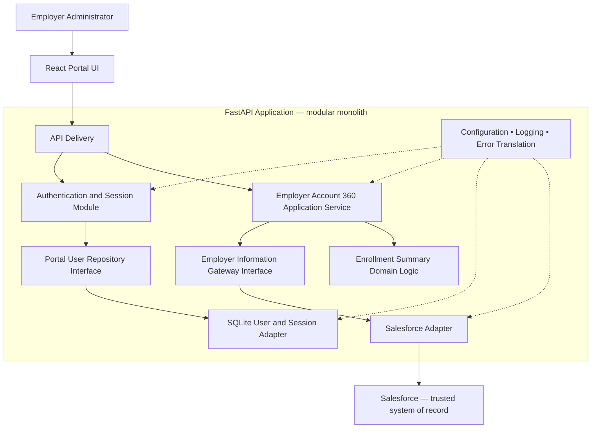

# Implementation Design — Employer Account Portal

**Showcase:** WorkflowFox Showcase #2  
**Phase:** 5 — Implementation Design  
**Status:** Draft for review  
**Authoritative baselines:** [Business Discovery](../discovery/01-business-discovery.md), [Functional Requirements](../requirements/02-functional-requirements.md), [Domain Model](../domain-model/03-domain-model.md), and [Solution Architecture](../architecture/04-solution-architecture.md)  
**Scope:** Employer Account 360 read-only MVP  
**Technology reference review:** 2026-08-10

## 1. Executive Summary

The Employer Account Portal will be implemented as a small web application with two independently testable codebases:

- a **React and TypeScript frontend**, built with Vite; and
- a **Python and FastAPI backend**, organized as a modular monolith.

The backend will own authentication, server-side portal sessions, Employer Account 360 orchestration, Enrollment Summary calculation, and Salesforce integration. A local **SQLite** database will hold the small fixed set of portal users and server-side session state. Salesforce will remain the authoritative source for Employer Account, Employer Contact, and Enrollment information.

The backend will communicate with Salesforce through one isolated adapter using a dedicated service account and standards-based server-to-server connectivity. The adapter will contain all Salesforce-specific queries, field mappings, response handling, and error translation. The rest of the backend will depend on business-oriented interfaces and will be testable with an in-memory or fixture-backed Salesforce substitute.

The implementation will remain synchronous from the frontend's perspective. After the Employer Account context is established, the backend may perform the independent Contacts and Enrollment retrieval operations concurrently within the same request. No queues, background workers, replicated business database, API gateway, or microservices are required.

This approach is appropriate for the showcase because it is small enough to understand and demonstrate, yet preserves the approved enterprise boundaries: portal-owned identity, business-oriented services, server-side Salesforce access, read-only source data, partial child-section degradation, explicit validation, and technology replaceability.

No application code, API endpoint, OpenAPI document, physical database schema, deployment design, or runtime AI capability is created in this phase.

## 2. Implementation Goals

| ID | Goal | Design response |
|---|---|---|
| IG-001 | Low implementation complexity | Use one frontend, one modular backend, one embedded portal-user store, and Salesforce as the only external business-data source. |
| IG-002 | Clean architectural separation | Keep UI, API delivery, application orchestration, domain rules, persistence, and Salesforce integration in explicit modules with inward dependency direction. |
| IG-003 | Rapid AI-assisted development | Favor typed, widely documented technologies with deterministic scaffolding, tests, and linting that can validate generated work. |
| IG-004 | Strong automated testing | Make application services depend on replaceable interfaces so authentication, mapping, orchestration, and partial failures can be tested without Salesforce. |
| IG-005 | Secure Salesforce integration | Keep credentials and Salesforce calls on the backend; use one least-privilege service account and never delegate an Employer Administrator's identity. |
| IG-006 | Understandable GitHub repository | Organize by application and business capability, document local modes, and provide representative fixtures without committing credentials. |
| IG-007 | Independent evolution where useful | Separate frontend and backend source trees and contract them through an approved OpenAPI artifact in the next phase. |
| IG-008 | Simple deployment options | Produce only two build outputs and avoid infrastructure dependencies; final hosting and topology remain deferred. |
| IG-009 | Technology replaceability | Put Salesforce, SQLite, session, and delivery mechanisms behind module boundaries rather than embedding them in domain logic. |
| IG-010 | Scope control | Implement only login, logout, authenticated session behavior, and read-only Employer Account 360. |

### 2.1 Implementation assumptions

- The approved scale remains a few sample users, up to approximately 50 Contacts, and up to approximately 1,000 Enrollment Records for one Account.
- The normal showcase target remains an Account 360 response within three seconds without a cache.
- The frontend and backend can be developed independently even if a later deployment packages or hosts them together.
- The target development environment can run current supported Python and Node.js toolchains.
- The Salesforce development environment exposes the approved fields, relationships, and a unique Contact correlation field.
- A dedicated Salesforce integration identity and suitable API entitlement will be available before real-integration validation.
- Exact security controls, API operations, Salesforce field API names, and deployment topology will be approved in their later phases.

## 3. Technology Decision Matrix

Technology decisions are based on the approved scope, not reuse from another showcase. The comparison uses current official documentation as a capability reference; exact supported versions will be pinned and recorded when implementation begins.

### 3.1 Frontend

| Option | Strengths | Weaknesses | Fit for this showcase | Decision |
|---|---|---|---|---|
| [React](https://react.dev/) with TypeScript and Vite | Component-oriented; strong TypeScript support; small conceptual surface; flexible test tooling; Vite is documented by React as a supported build-from-scratch option. | Requires explicit choices for routing, data access, and project conventions; less prescriptive than a full framework. | High. The portal has two principal experiences—login and Account 360—and does not require server rendering, public SEO, or a full frontend platform. | **Selected.** Use React, TypeScript strict mode, and Vite with capability-oriented frontend folders. |
| [Next.js](https://nextjs.org/docs) | Full-stack React framework; integrated routing, bundling, rendering, and server capabilities; productive conventions. | Its server-rendering and full-stack features duplicate responsibilities intentionally assigned to the separate Application API; adds server/client rendering choices that do not improve this authenticated MVP. | Medium. Technically strong, but more framework surface than the portal requires. | Not selected for the MVP. Reconsider if public content, server rendering, or a unified JavaScript full-stack application becomes an approved requirement. |
| [Angular](https://angular.dev/overview) | Comprehensive framework with first-party routing, forms, dependency injection, tooling, update support, and large-team conventions. | More concepts, generated structure, and framework ceremony than this small showcase needs. | Medium. Enterprise-relevant, but optimized for a broader and longer-lived frontend than the approved MVP. | Not selected. It remains a reasonable client option for organizations standardized on Angular. |

**Frontend decision:** React provides the smallest sufficient UI abstraction while TypeScript and Vite supply compile-time checks and a fast local workflow. A minimal router may separate login and authenticated views; no global state-management library or UI design system is selected before UX Design demonstrates a need.

### 3.2 Backend / Application API

| Option | Strengths | Weaknesses | Fit for this showcase | Decision |
|---|---|---|---|---|
| Python + [FastAPI](https://fastapi.tiangolo.com/features/) | Concise typed application code; Pydantic validation; OpenAPI support; dependency injection; HTTP test client support; strong fit for I/O-bound integration and rapid validated iteration. | Smaller compile-time safety boundary than Java; architectural discipline must be enforced by module structure and static checks rather than the framework alone. | High. Supports a small, typed modular monolith and fast AI-assisted test generation without requiring enterprise framework infrastructure. | **Selected.** Use FastAPI only at the delivery boundary; application and domain modules remain framework-independent. |
| Java + [Spring Boot](https://spring.io/projects/spring-boot/) | Mature enterprise ecosystem; opinionated production features; strong dependency injection, security, configuration, testing, and operational conventions. | Higher build, code, and configuration surface for a read-only MVP; more ceremony than required to prove the architecture. | High for a large enterprise product, medium for this showcase. | Not selected. Prefer for a client environment standardized on Java or when broader production requirements justify the platform. |
| [Node.js](https://nodejs.org/learn) + TypeScript | Shared language with the frontend; strong asynchronous I/O model; broad ecosystem; good developer availability. | Requires a further framework and convention decision to obtain a consistent enterprise application structure; sharing a language does not remove the need for API and module boundaries. | High and a close alternative. | Not selected. FastAPI offers a more concise typed contract-and-integration implementation for this specific showcase; Node.js remains a viable substitution behind the same logical architecture. |

**Backend decision:** FastAPI will provide request delivery and validation, while plain Python application services and domain types preserve clean dependency direction. FastAPI's generated schema is implementation evidence, not the requirements source of truth; it must conform to the separately approved OpenAPI contract created in API Design.

### 3.3 Portal-user storage

| Option | Strengths | Weaknesses | Fit for this showcase | Decision |
|---|---|---|---|---|
| Local JSON or configuration-based users | Minimal setup; easy to inspect; sufficient for a throwaway demonstration. | Weak uniqueness and transactional guarantees; awkward enabled-state changes and session handling; encourages sensitive seed material in files; poor migration path. | Low to medium. Simpler initially but does not demonstrate responsible credential-backed user storage. | Not selected. JSON may still supply non-sensitive test fixtures, never runtime password data. |
| [SQLite](https://www.sqlite.org/about.html) | Embedded, serverless, single-file, transactional SQL store; supports uniqueness and controlled migrations without a database service. | Single-node file storage is not the intended production answer for horizontal scale; operational backup and concurrency limits must be reconsidered later. | High. It is the simplest option that supports responsible portal-user and server-side-session persistence. | **Selected.** Access through repository interfaces with controlled schema migrations and seed tooling. |
| Separate lightweight relational database service | Familiar production operating model; better multi-instance concurrency and operational growth path. | Adds service setup, credentials, lifecycle, and deployment complexity with no approved scale requirement. | Low for this MVP. | Not selected. Revisit when production availability, concurrency, or deployment topology requires it. |

### 3.4 Salesforce connectivity

The expected implementation uses Salesforce's server-side platform APIs over HTTPS from the backend, with an OAuth-capable dedicated integration identity and least-privilege read permissions. Salesforce documents client credentials as a server-to-server option using a single integration user and emphasizes scoping that user's access to the minimum required data ([Salesforce reference](https://developer.salesforce.com/blogs/2024/02/invoke-rest-apis-with-the-salesforce-integration-user-and-oauth-client-credentials)).

The exact OAuth flow, client configuration, credential storage, token lifecycle, Salesforce API version, and entitlement remain Security Design decisions. The implementation will use a general-purpose typed HTTP client rather than placing a Salesforce SDK throughout the application. This keeps Salesforce behavior explicit and confined to one adapter.

## 4. Selected Technology Stack

| Concern | Selection | Rationale and boundary |
|---|---|---|
| Frontend | React + TypeScript + Vite | Small component model, strict typing, fast development, and no unnecessary server-rendering layer. |
| Frontend routing | Minimal client-side routing | Supports login and authenticated Account 360 navigation only; exact route design belongs to UX and API phases. |
| Frontend data access | Browser-native HTTP client behind one typed application client | Avoids an unnecessary dependency; no component calls Salesforce or constructs backend operations directly. |
| Backend | Python + FastAPI + Pydantic | Typed delivery models and validation with a concise modular-monolith implementation. |
| Backend HTTP client | HTTPX | Centralized server-side Salesforce connectivity with explicit timeouts and test substitution. |
| Portal-user persistence | SQLite through SQLAlchemy, with Alembic migrations | Provides transactional users and sessions, uniqueness enforcement, repository abstractions, and reproducible evolution without a database server. |
| Authentication boundary | Portal authentication service with replaceable password-hasher and session-store interfaces | Supports username/password and server-side sessions while leaving algorithms and cookie controls to Security Design. |
| Salesforce connectivity | Dedicated Salesforce adapter using platform REST/query capabilities over HTTPS | Keeps service-account authentication, source queries, paging, mappings, and errors isolated. No browser access or end-user Salesforce identity. |
| Backend unit/integration testing | pytest, FastAPI test utilities, HTTPX mocking/stubbing | Supports isolated domain, application, persistence, delivery, and adapter testing. |
| Frontend testing | Vitest, React Testing Library, and Playwright for a small end-to-end suite | Covers component behavior, user-visible states, and the full login-to-Account-360 journey. |
| API contract tooling | OpenAPI 3.1 document in `contracts/`, Spectral linting, `openapi-typescript` for frontend types, and automated comparison of FastAPI's generated description with the approved contract | API Design owns the contract; generated types reduce frontend drift; CI detects contract mismatch. No contract is created in this phase. |
| Frontend quality | TypeScript strict mode, ESLint, Prettier | Type, lint, and formatting checks are deterministic and automation-friendly. |
| Backend quality | Ruff formatting/linting and mypy static type checking | Keeps Python style and type validation fast and repeatable. |
| Configuration | Typed backend settings sourced from environment variables and validated non-secret mapping configuration; placeholder examples only | Separates runtime settings from code and secrets. The frontend receives only public portal configuration. |
| Logging | Structured application logs written through one logging abstraction | Enables request correlation and local/host capture without selecting an observability platform. |

Exact versions will be pinned to supported stable releases at implementation start and recorded in dependency manifests. Version selection must be reproducible and pass the complete validation suite before upgrade.

## 5. Implementation Architecture

The implementation will use a React frontend and a FastAPI modular monolith. Modules are process-internal boundaries, not microservices.



### 5.1 Module dependency rules

- Frontend feature modules depend only on the typed portal API client and frontend shared components.
- API delivery depends on application services and API models; it contains no business calculations or Salesforce mappings.
- Application services depend on domain models and interfaces for users, sessions, and employer information.
- Domain models and Enrollment Summary rules depend on no web framework, database library, or Salesforce representation.
- SQLite and Salesforce modules implement inward-facing interfaces; application modules do not import their concrete details.
- Configuration, logging, and error translation are accessed through controlled application infrastructure, not global business-rule dependencies.
- Salesforce source DTOs never become portal API DTOs or frontend types.

### 5.2 Deployable shape

The design produces two buildable applications: the frontend assets and the backend application. A later deployment phase may host them together or separately. There is no third application service, API gateway, queue, cache, or portal-owned employer database.

## 6. Frontend Design

The frontend is organized around the two approved user journeys: authenticate and view Employer Account 360.

### 6.1 Responsibilities

| Frontend area | Responsibility |
|---|---|
| Login page | Collect username and password, submit them only to the portal backend, show a generic authentication failure, and avoid username-existence disclosure. |
| Authenticated shell | Represent signed-in portal state, provide logout, and prevent Account 360 presentation when the portal session is absent or invalid. |
| Employer Account overview | Present Employer Name, Employer/Group ID, Status, and Industry from the business-oriented response. |
| Contacts section | Present approved Contact fields; distinguish available records, confirmed empty, and unavailable. |
| Enrollment Summary | Present Total, Active, Pending, and Terminated counts only when Enrollment data is complete and available. |
| Enrollment records | Present the approved Enrollment fields and statuses; distinguish available records, confirmed empty, and unavailable. |
| Loading states | Indicate authentication and Account 360 work without inventing progress or exposing source operations. |
| Empty states | Represent a confirmed empty Contacts or Enrollment collection as a valid result. |
| Unavailable states | Present the approved safe message and section-level state without Salesforce errors or technical details. |
| Logout | Request backend session invalidation, clear local authenticated UI state, and return to the login experience. |

### 6.2 Frontend boundaries

- The frontend uses portal API types created from the later approved contract.
- Session credentials are not read or persisted by application JavaScript when the Security Design selects the expected protected cookie model.
- Feature components do not construct raw network requests; one typed API client owns portal communication.
- No Salesforce object name, field API name, SOQL statement, Salesforce URL, access token, service credential, or SDK appears in frontend source or configuration.
- No frontend business rule recalculates Enrollment counts; the backend returns the authoritative derived summary.
- No global state library is introduced unless implementation evidence shows React's built-in state and feature hooks are insufficient.
- Detailed layout, visual language, accessibility behavior, responsive rules, and content hierarchy remain UX Design responsibilities.

## 7. Backend Design

The backend is a modular monolith with the following implementation modules.

| Module | Responsibilities | Must not contain |
|---|---|---|
| API delivery | Receive portal requests, validate API models, invoke application services, translate application outcomes to the later contract, and attach request context. | Business calculations, SQL, Salesforce queries, source errors, or UI logic. |
| Authentication service | Validate enabled portal users through the user repository and password-hasher interface; create, validate, and invalidate server-side sessions. | Salesforce authentication, Contact lookup, or Account 360 orchestration. |
| Portal-user repository interface | Express user lookup, enabled-state, UUID identity, and Contact-correlation needs in application terms. | SQLite constructs or schema knowledge. |
| Session repository interface | Express server-side session creation, lookup, expiry, and invalidation. | Cookie implementation or database constructs. |
| Employer Account 360 application service | Enforce authenticated context; resolve the employer context through the gateway; coordinate Account, Contacts, and Enrollment retrieval; apply partial-failure rules; compose the result. | SOQL, source DTOs, password logic, or presentation formatting. |
| Enrollment Summary domain service | Calculate approved counts from a complete, validated Enrollment collection. | Network access, persistence, or unavailable-data guessing. |
| Domain models | Represent Employer Account, Employer Contact, Enrollment Record, Enrollment Summary, section availability, and authorized context. | FastAPI, SQLAlchemy, frontend, or Salesforce types. |
| API DTO models | Represent the later approved portal contract and map application results at the delivery edge. | Salesforce fields or source error messages. |
| SQLite adapter | Persist sample users and server-side sessions; enforce storage-level uniqueness and controlled migrations. | Account, Contact, or Enrollment replicas. |
| Salesforce gateway interface | Define the employer-information capabilities required by the application in domain language. | Transport or Salesforce details. |
| Salesforce adapter | Manage service-account connectivity, source queries, paging, source mappings, timeouts, response validation, and platform-neutral errors. | Portal authentication, session logic, Enrollment summary calculation, or frontend models. |
| Configuration | Load and validate typed application, mapping, timeout, session, Salesforce, and logging settings. | Hard-coded secrets or business rules. |
| Logging | Emit structured, correlated, redacted operational events. | Credentials, password material, tokens, or unnecessary business data. |
| Error translation | Maintain a typed internal error taxonomy and user-safe application outcomes. | Raw stack traces or source messages in client-facing models. |

Dependency injection is used at application startup to connect interfaces to SQLite, Salesforce, mock Salesforce, and other adapters. Business services receive dependencies explicitly, enabling deterministic tests.

## 8. Portal User Implementation

### 8.1 Selected approach

Portal users and server-side sessions will be stored in SQLite. The backend owns the database and accesses it through repository interfaces. The database is not used to replicate Salesforce Account, Contact, or Enrollment data.

Each conceptual portal-user record contains:

- a stable portal-user UUID;
- a unique username;
- a strong one-way password representation;
- an enabled or disabled state; and
- one stable UUID correlation identifier matching exactly one Salesforce Contact.

The physical table, column, index, and constraint definitions belong to Data Model. At minimum, the implementation must enforce unique usernames, unique portal-user identifiers, and unique Contact-correlation values.

### 8.2 Authentication and session boundary

- Authentication looks up the user by normalized username without disclosing whether the username exists.
- Disabled users cannot establish a new session.
- Password verification occurs only through a replaceable password-hasher interface.
- Plaintext passwords are accepted only transiently during login or controlled local seeding and are never persisted or logged.
- Successful authentication creates an opaque server-side session associated with the portal-user UUID.
- SQLite persists session state for the MVP so logout and expiry can invalidate the session on the server.
- The browser is expected to receive only an opaque session reference through a protected cookie; exact cookie flags, lifetime, rotation, CSRF protection, and hashing choices are Security Design decisions.
- Account 360 orchestration resolves the user from the validated session rather than accepting a user or Salesforce identifier from the frontend.

### 8.3 Seeded users

A controlled seed task will create the few sample users. Public repository seed definitions may include fictional usernames, enabled state, and UUID correlation values, but no reusable plaintext passwords, password hashes, or secrets. Local setup will supply sample passwords through a protected input or environment-specific secret and generate the password representation at seed time.

The implementation will not include registration, invitations, forgot-password, password reset, user-administration UI, multi-factor authentication, delegated administration, or multi-employer switching.

## 9. Salesforce Integration Design

### 9.1 Gateway boundary

Application Services depend on an `Employer Information Gateway` expressed in business terms. Its conceptual capabilities are:

- resolve the authorized Employer Contact and Employer Account from the correlation UUID;
- retrieve the approved Employer Account information;
- retrieve the Account's approved Employer Contacts; and
- retrieve the Account's approved Enrollment Records.

These are internal implementation capabilities, not API endpoints or a finalized interface signature.

### 9.2 Salesforce adapter responsibilities

- Acquire and manage Salesforce access under the dedicated service account using the Security Design's approved mechanism.
- Use a centrally configured supported Salesforce API version.
- Look up the Contact by the configured unique UUID correlation field and require exactly one result.
- Resolve exactly one Account from the correlated Contact.
- Retrieve only Employer Name, Employer/Group ID, Status, and Industry for the authorized Account.
- Retrieve only First Name, Last Name, Email, Phone, and Role/Title for Contacts belonging to the authorized Account.
- Retrieve only Enrollment ID, Employee/Member Display Name, Plan Name, Status, and Effective Date for Enrollment Records belonging to the authorized Account.
- Handle source result paging internally so Business Services receive a complete validated collection within the approved MVP volume.
- Map raw Salesforce responses first into adapter-private source models and then into application domain models.
- Normalize the approved Enrollment statuses—Active, Pending, and Terminated—at the adapter boundary without inventing additional business statuses.
- Reject missing required fields, invalid status values, invalid cardinality, or malformed source responses as typed integration failures.
- Apply configured connection and operation timeouts.
- Translate authentication, authorization, connectivity, timeout, rate-limit, query, source, and validation failures into platform-neutral application errors.
- Emit correlated operation names, outcomes, counts, and latency without logging source payloads or sensitive values.

### 9.3 Isolation and testability

- Salesforce-specific field API names, object API names, SOQL, authentication, response DTOs, paging, and error codes exist only inside the Salesforce adapter and its configuration.
- The frontend and application services never receive raw Salesforce IDs unless an approved business identifier explicitly requires one in the later Data Model and API Design.
- A deterministic fixture-backed adapter implements the same gateway for local development and automated tests.
- Unit and application integration tests run without Salesforce connectivity.
- A small, separately invoked validation suite verifies the real adapter against representative Salesforce development data.

### 9.4 Timeouts and retry behavior

All Salesforce operations use bounded configuration-controlled connection and response timeouts within the three-second Account 360 target. The MVP will not add general automatic request retries; a failed read becomes an unavailable outcome so latency and rate-limit consumption remain predictable. One token reacquisition after an authentication challenge may be supported if required by the approved Salesforce authentication mechanism, but its behavior belongs to Security Design.

No Salesforce client library is allowed outside the adapter. The initial implementation will prefer a standards-based HTTP client to make source calls, mappings, and errors explicit.

## 10. Employer Account 360 Orchestration

The Account 360 application service implements this sequence:

| Step | Action | Owner | Failure behavior |
|---|---|---|---|
| 1 | Authenticate user | Authentication service | Invalid credentials produce a generic login failure; no session or business retrieval occurs. |
| 2 | Resolve portal user | Authentication service and user repository | Missing, disabled, or invalid user state fails closed. |
| 3 | Obtain Contact correlation identifier | Validated portal session / user context | The frontend cannot supply or override the value. Missing or invalid correlation fails closed. |
| 4 | Resolve Salesforce Contact | Salesforce adapter through the gateway | Zero or multiple Contacts fail closed as invalid correlation. |
| 5 | Resolve Employer Account | Salesforce adapter | Zero or multiple Accounts fail closed; no Account 360 is returned. |
| 6 | Retrieve Account information | Salesforce adapter | Account unavailability fails the Account 360 request because Account is the required parent context. |
| 7 | Retrieve Contacts | Salesforce adapter | After context establishment, failure marks only Contacts unavailable. Confirmed zero is empty. |
| 8 | Retrieve Enrollment Records | Salesforce adapter | After context establishment, failure marks Enrollment and its Summary unavailable. Confirmed zero is empty. |
| 9 | Calculate Enrollment Summary | Enrollment Summary domain service | Runs only for a complete, available Enrollment collection. |
| 10 | Compose Account 360 response | Account 360 application service | Combines Account, section results, summary, and platform-neutral availability states. |
| 11 | Return to frontend | API delivery | Maps the application result to the later approved contract without source details. |

After Account retrieval succeeds, Contacts and Enrollment retrieval are independent. The backend may execute those two I/O operations concurrently within the same synchronous Account 360 request, then compose a deterministic result. This is in-process concurrency, not asynchronous business processing or a background workflow.

Every operation carries a request/correlation ID through delivery, application, and integration logs.

## 11. Enrollment Summary Implementation

Enrollment Summary calculation belongs to a pure backend domain service.

### 11.1 Inputs and rules

- Input is the complete validated Enrollment collection for the authorized Employer Account.
- `Total` equals the number of records in that collection.
- `Active`, `Pending`, and `Terminated` count records with the corresponding approved canonical status.
- Every available record must contribute to `Total` and exactly one approved status count.
- A successfully retrieved empty collection produces zero for all four counts.
- The function does not access Salesforce, configuration, persistence, the session, or the frontend.

### 11.2 Unavailable or invalid data

- If Enrollment retrieval is unavailable, the calculation is not called and the Summary state is unavailable.
- If the adapter encounters a missing required value, unsupported status, malformed record, incomplete page, or other condition that prevents a complete trusted collection, the Enrollment section is unavailable and no summary is calculated.
- The implementation must never substitute an empty list for unavailable or incomplete Enrollment data.
- The frontend does not recalculate counts from visible records.

The pure calculation is independently unit tested for populated, single-status, mixed-status, and zero-record collections.

## 12. Error Handling Design

Errors are translated at module boundaries. Technical detail is retained in redacted logs; the frontend receives only the approved application category and user-safe message required by the later API contract.

| Category | Typical technical condition | Application behavior | User-safe outcome |
|---|---|---|---|
| Authentication failure | Unknown username, wrong password, disabled user | Do not create a session; log a non-enumerating authentication failure. | Generic login failure. |
| Invalid or expired session | Missing, expired, revoked, or unresolvable server session | Reject the business request and require authentication. | Session no longer valid; return to login using later approved wording. |
| Unauthorized context | Session user cannot establish the approved employer relationship | Fail closed; return no employer information. | Generic access-unavailable response without confirming another employer exists. |
| Invalid correlation | Missing/malformed UUID, zero/multiple Contact matches, zero/multiple Account relationships | Fail closed; emit a correlation-integrity event. | Generic access-unavailable response. |
| Salesforce unavailable | Credential, network, timeout, rate-limit, or source-platform failure | Translate to an unavailable Account 360 or child-section result according to the failure point. | “This information is temporarily unavailable. Please try again later.” |
| Account unavailable | Account resolution or required Account data cannot be completed | Fail the complete Account 360 operation. | Business-safe unavailable response. |
| Contacts unavailable | Contacts retrieval or validation fails after Account context succeeds | Preserve Account and available Enrollment; mark Contacts unavailable. | Section-level unavailable message. |
| Enrollment unavailable | Enrollment retrieval, paging, mapping, or validation fails after Account context succeeds | Preserve Account and available Contacts; mark Enrollment and Summary unavailable. | Section-level unavailable message; no counts. |
| Unexpected application error | Unhandled defect or internal invariant failure | Return a generic failure, log an internal error category with correlation ID, and expose no stack trace. | Generic temporary-unavailable response. |

Raw Salesforce messages, source response bodies, SOQL, stack traces, credentials, tokens, password material, and internal exception names must not appear in frontend responses.

The later API Design will assign concrete response models and protocol status semantics. This phase defines behavior and boundaries only.

## 13. Partial Failure Strategy

Partial failure begins only after the authenticated user, correlated Salesforce Contact, and Employer Account context have been established safely.

### 13.1 Fail-closed gate

The complete Account 360 operation fails closed when any of the following is invalid or unavailable:

- portal authentication or session;
- portal user or enabled state;
- Contact correlation UUID;
- unique Salesforce Contact resolution;
- unique Employer Account resolution; or
- required Employer Account overview retrieval.

No Employer Account, Contact, or Enrollment information is returned when this gate fails.

### 13.2 Independent child sections

| Account | Contacts | Enrollment | Result |
|---|---|---|---|
| Available | Available with data | Available with data | Return complete Account 360 and calculated Summary. |
| Available | Empty | Empty | Return Account, confirmed empty sections, and zero-valued Summary. |
| Available | Unavailable | Available | Return Account and Enrollment with Summary; mark Contacts unavailable. |
| Available | Available | Unavailable | Return Account and Contacts; mark Enrollment and Summary unavailable. |
| Available | Unavailable | Unavailable | Return Account; mark both child sections and Summary unavailable. |
| Unavailable | Any | Any | Fail the complete Account 360 operation. |

An unavailable child section is never converted to an empty collection. An unavailable Enrollment section never produces zero counts. Partial results contain explicit section-state metadata in the later API model so the frontend does not infer state from missing fields.

## 14. Configuration Design

Configuration is typed, validated at backend startup, and separated from business rules.

| Category | Examples | Treatment |
|---|---|---|
| Portal application settings | Runtime mode, allowed frontend origin where applicable, public application name | Non-secret environment-specific configuration. Deployment-specific values remain deferred. |
| Salesforce connection settings | Org/base URL, API version, authentication-mode selector | Backend-only configuration. Credentials and tokens are separate secrets. |
| Salesforce mappings | Contact correlation field, Enrollment custom-object name, approved Account/Contact/Enrollment field API names | Validated adapter configuration or mapping module. These values translate approved domain fields; they cannot add fields to the MVP. |
| Timeouts | Connection and per-operation response budgets | Backend-only numeric configuration validated against the overall response target. No unbounded values. |
| Session settings | Expiry, idle behavior, cookie name and security controls | Backend-only; final values and controls require Security Design. |
| Logging settings | Level, structured output mode, local readability | Non-secret; cannot enable sensitive payload logging. |
| Local integration mode | Fixture-backed Salesforce or real Salesforce adapter | Non-secret mode selection. Real mode requires protected credentials. |

Secrets include Salesforce client credentials or equivalent key material, Salesforce access tokens, portal session secrets, and cryptographic material. They must be supplied outside source control. The repository may contain `.env.example`-style placeholders and documented variable names but no sensitive values.

The frontend receives only public portal settings and its backend location. It never receives Salesforce configuration or secrets.

Configuration validation fails application startup when required values are missing, malformed, mutually inconsistent, or attempt to map unapproved fields. Exact secret-management technology and environment separation remain Security Design and Deployment Design decisions.

## 15. Logging and Observability Design

The implementation uses structured application logs through one backend logging configuration. Local development may render those events readably; hosted capture is a later deployment decision. No external observability platform is required for the MVP.

### 15.1 Event categories

| Category | Example events and measures |
|---|---|
| Authentication | Login succeeded/failed, disabled user rejected, logout, session invalidated or expired. |
| Authorization and correlation | Context resolution succeeded/failed, invalid correlation cardinality, Account relationship failure. |
| Account 360 execution | Request started/completed/degraded/failed, total backend latency, resulting section states. |
| Salesforce operations | Logical operation name, success/failure category, duration, record count, rate-limit/unavailable outcome. |
| Section degradation | Contacts unavailable, Enrollment unavailable, Summary withheld, empty collection confirmed. |
| Unexpected failures | Internal error category, safe diagnostic location, request ID. |

### 15.2 Correlation

- Every incoming business request receives or is assigned a request/correlation ID.
- The same ID flows through API delivery, application services, Salesforce adapter operations, and the resulting error response where the later contract permits.
- Portal-user UUID, Salesforce record IDs, email addresses, employee/member names, and source payloads are not used as correlation IDs.

### 15.3 Prohibited logging

The implementation must never log plaintext passwords, password hashes, session secrets or identifiers in reusable form, Salesforce credentials, access/refresh tokens, cryptographic material, full Salesforce responses, SOQL with sensitive values, or unnecessary Contact and Enrollment details.

Redaction behavior will have automated tests. Retention, access control, alerting, metrics aggregation, and hosted monitoring belong to Security and Deployment Design.

## 16. Testing Design

The test strategy follows the dependency boundaries so most validation runs without Salesforce.

### 16.1 Unit tests

| Area | Required coverage |
|---|---|
| Authentication logic | Unknown user, wrong password, disabled user, valid user, generic failure behavior, hasher substitution. |
| Session logic | Creation boundary, validation, expiry, logout invalidation, user resolution. |
| Enrollment Summary | Empty, one status, mixed statuses, total reconciliation, unsupported-status rejection before calculation. |
| Salesforce mapping | Approved fields, canonical statuses, missing fields, malformed values, source-error translation. |
| Authorization rules | Session user correlation cannot be overridden; zero/multiple Contact and Account matches fail closed. |
| Error handling | Every typed internal error maps to the correct application outcome without leaking technical detail. |

### 16.2 Backend integration tests

- FastAPI delivery with real application services and test SQLite repositories.
- Seeded user authentication, server-side session behavior, and logout.
- Successful Account 360 flow using the fixture-backed Employer Information Gateway.
- Confirmed empty Contacts and Enrollment collections.
- Contacts-only and Enrollment-only partial failures.
- Enrollment unavailable with Summary absent/unavailable.
- Invalid correlation, unauthorized context, missing Account, and unexpected adapter errors.
- Structured logging and request-ID propagation with sensitive-value redaction.

### 16.3 Salesforce adapter tests

- HTTP-level stub tests for service-account token acquisition boundary, source requests, paging, timeouts, rate-limit responses, malformed payloads, and source-error translation.
- Mapping tests based on sanitized representative Salesforce responses.
- No real Salesforce connectivity in the ordinary unit or backend integration suite.

### 16.4 Contract tests

- Lint and validate the later approved OpenAPI document.
- Generate frontend TypeScript types from the approved contract.
- Compare the backend-generated OpenAPI representation with the approved contract and fail on incompatible drift.
- Exercise representative requests and responses against contract schemas.
- Do not allow generated framework documentation to silently become the requirements baseline.

### 16.5 Frontend tests

- Login submission, generic failure, successful transition, and disabled interaction while loading.
- Authenticated-shell behavior and invalid-session return to login.
- Account overview rendering from business-oriented data.
- Contacts and Enrollment populated, empty, and unavailable states.
- Enrollment Summary visible only with complete Enrollment data.
- Partial-failure combinations defined in §13.2.
- Logout and cleared authenticated UI state.
- Assertions that user-visible errors contain no Salesforce or technical detail.

### 16.6 End-to-end and Salesforce validation

- A small Playwright suite covers login, Account 360, partial failure, and logout against the mock backend mode.
- A separate, explicitly enabled validation suite uses the Salesforce development environment and representative fictional data to verify service-account access, correlation, Account resolution, fields, relationships, Enrollment counts, and the approximate 1,000-record scenario.
- Salesforce-connected validation is not a prerequisite for every local test run; it is required before the integration is declared validated.

Static checks, tests, contract validation, and build validation must run through repeatable repository tasks suitable for local use and continuous integration.

## 17. Proposed Repository Structure

The following structure is proposed; this phase does not create it.

```text
employer-account-portal/
├── README.md
├── docs/
│   ├── discovery/
│   ├── requirements/
│   ├── domain-model/
│   ├── architecture/
│   ├── design/
│   ├── api/
│   ├── security/
│   ├── data-model/
│   ├── ux/
│   └── validation/
├── frontend/
│   ├── src/
│   │   ├── app/                    # composition, routing, authenticated shell
│   │   ├── features/
│   │   │   ├── authentication/
│   │   │   └── employer-account-360/
│   │   ├── components/             # reusable presentation primitives
│   │   ├── api/                    # typed portal client and generated contract types
│   │   ├── test/                   # shared test setup and fixtures
│   │   └── main entry
│   ├── tests/
│   └── dependency manifests and tool configuration
├── backend/
│   ├── app/
│   │   ├── api/                    # FastAPI delivery and API DTO mapping
│   │   ├── application/
│   │   │   ├── authentication/
│   │   │   └── employer_account_360/
│   │   ├── domain/                 # business models, states, summary rules
│   │   ├── ports/                  # user, session, and employer-information interfaces
│   │   ├── adapters/
│   │   │   ├── persistence/        # SQLite repositories
│   │   │   └── salesforce/         # source auth, queries, mappings, errors
│   │   └── core/                   # configuration, logging, request IDs, errors
│   ├── migrations/                 # portal-user/session storage evolution
│   ├── seed/                       # non-sensitive sample-user definitions and seed task
│   ├── tests/
│   │   ├── unit/
│   │   ├── integration/
│   │   └── salesforce_adapter/
│   └── dependency manifests and tool configuration
├── contracts/
│   └── openapi.yaml                # created and approved in API Design, not this phase
├── tests/
│   ├── e2e/
│   └── fixtures/
│       └── salesforce/             # fictional, sanitized source-response fixtures
├── scripts/                        # repeatable setup, seed, validation, and run tasks
├── engineering-journal/
├── prompts/                        # reviewed AI-assistance records suitable for publication
├── .gitignore
└── root task and quality configuration
```

Generated files, local SQLite databases, environment files, secrets, logs, caches, test output, and build output must be ignored. The repository structure separates artifacts by lifecycle phase and code by business responsibility.

## 18. Local Development Experience

Local development must work without Salesforce by default.

### 18.1 Expected workflow

1. Install the pinned frontend and backend toolchains documented by the repository.
2. Copy placeholder configuration examples to local ignored files and choose fixture-backed Salesforce mode.
3. Initialize the local SQLite store through the migration task.
4. Seed fictional portal users, supplying local sample passwords outside committed files.
5. Start the FastAPI backend with the fixture-backed Employer Information Gateway.
6. Start the Vite frontend against the local backend.
7. Log in with documented local-only credentials and exercise populated, empty, unavailable, and partial-failure fixture scenarios.
8. Run formatting, linting, type checking, unit tests, integration tests, contract checks when available, frontend tests, and the mock end-to-end suite through repeatable root tasks.

### 18.2 Real Salesforce mode

Real mode replaces only the gateway implementation and its configuration. The developer supplies protected Salesforce development credentials and approved field mappings, then runs the explicitly selected Salesforce validation suite. The frontend, authentication module, Account 360 application service, domain logic, and portal-user store remain unchanged.

### 18.3 Repository usability

- The README will explain mock mode before real mode.
- Fictional fixtures will demonstrate all approved states without exposing client data.
- One root task interface will wrap common setup, run, test, lint, and validation operations so contributors do not need to memorize tool-specific commands.
- External services other than Salesforce in real-integration mode are not required.

## 19. AI-Assisted Engineering Considerations

AI supports implementation productivity; it is not an Employer Account 360 runtime feature.

| Engineering activity | Appropriate AI assistance | Required control |
|---|---|---|
| Repository scaffolding | Generate proposed folders, baseline manifests, and module shells from the approved design. | Human review against the approved structure; build and lint immediately. |
| Frontend components | Draft login and Account 360 components and state variations. | Validate against UX Design, contract types, accessibility checks, and frontend tests. |
| Backend modules | Draft delivery adapters, application services, domain models, and repository implementations. | Enforce dependency rules, type checks, code review, and unit tests. |
| Salesforce adapter | Draft source models, mapping code, and stub fixtures from approved source metadata. | Salesforce expert review; allow-listed fields; sanitized fixtures; real-org validation. |
| Test generation | Generate boundary, negative, partial-failure, mapping, and contract test cases. | Review assertions against FR/AC/BR traceability; reject tests that merely reproduce generated code. |
| Contract alignment | Compare planned DTOs and generated types with the later approved OpenAPI contract. | Contract linting and automated conformance checks remain authoritative. |
| Security review assistance | Identify likely credential, session, injection, logging, and dependency risks. | Security Design and human threat review decide controls; never rely on AI approval. |
| Code review | Detect source leakage, missing error paths, untested branches, and scope expansion. | Human review plus deterministic static analysis and tests. |
| Documentation | Draft module guides, decision records, validation evidence, and engineering-journal entries. | Verify every claim against implemented and executed evidence. |

Prompts and meaningful AI-assisted decisions may be recorded for the Engineering Journal, but secrets, credentials, source payloads, and sensitive data must never be supplied to an AI tool. Every generated artifact remains subject to human ownership and automated validation.

## 20. Alternatives and Trade-offs

| Topic | Decision | Reason | Trade-off | Future evolution |
|---|---|---|---|---|
| Modular monolith vs microservices | One FastAPI modular monolith. | One use case and one external source do not justify distributed services. | Module discipline must be enforced inside one codebase; services cannot scale independently. | Extract only when an approved capability has independent ownership, scaling, or lifecycle needs. |
| Local portal-user store vs external identity provider | SQLite-owned sample users and server-side sessions. | Meets the approved few-user MVP with no external identity infrastructure. | The portal owns password and session risk; not the preferred enterprise production identity model. | Replace repository/authentication adapters with an enterprise identity provider after new requirements and Security Design. |
| Direct Salesforce retrieval vs replicated database | Retrieve authoritative Salesforce data for each Account 360 load. | Preserves source ownership and freshness and avoids synchronization infrastructure. | Portal latency and availability depend on Salesforce and API limits. | Consider bounded caching or replication only with approved freshness, resilience, volume, and governance requirements. |
| Single Account 360 API vs many frontend calls | One composite business operation for Account 360. | Keeps correlation, authorization, orchestration, summary rules, and partial-state semantics on the backend. | The backend coordinates multiple source operations and the response can be larger. | Add independently addressable operations only when approved UX or reuse requirements justify them. API Design defines the actual contract. |
| React vs Next.js vs Angular | React with TypeScript and Vite. | Smallest sufficient client for an authenticated API-driven portal. | The team must define conventions that fuller frameworks provide. | Adopt a fuller framework when public rendering, larger-team standards, or broader application scope creates value. |
| FastAPI vs Spring Boot vs Node.js | Python with FastAPI. | Concise typed integration service, productive testing, and strong contract support for the MVP. | Python and TypeScript create two language toolchains; Spring offers more built-in enterprise conventions. | The business-oriented contract and gateway boundary permit backend replacement without changing the domain. |
| JSON users vs SQLite vs database service | SQLite. | Adds transactional integrity and uniqueness without infrastructure. | File-backed storage limits multi-instance scale. | Move through the repository interface when production concurrency or availability requires a managed relational store. |
| Synchronous vs asynchronous processing | One synchronous Account 360 operation with bounded concurrent child retrieval. | The user is waiting for current source information and no background workflow is required. | End-to-end latency remains tied to Salesforce; concurrency adds modest orchestration complexity. | Add caching, prefetch, or asynchronous materialization only after approved scale and freshness requirements. |
| Salesforce SDK vs standards-based HTTP adapter | General-purpose HTTP client inside one adapter. | Keeps dependencies small and source behavior explicit while avoiding SDK leakage. | The team owns token, paging, query, and error-handling code. | Adopt a supported SDK inside the same adapter if it measurably reduces risk without spreading platform types. |
| Automatic retries vs explicit degradation | No general request retry in the MVP. | Protects the three-second target and Salesforce request allocation; failures are visible and testable. | A brief transient source failure may become user-visible. | Add bounded retry or resilience policies using measured failure and latency evidence. |

## 21. Implementation Risks

| ID | Risk | Impact | Mitigation in this design |
|---|---|---|---|
| IR-001 | Salesforce API coupling escapes the adapter. | Backend and frontend become difficult to test or port. | Enforce gateway interfaces, source-private models, restricted imports, mapping tests, and contract review. |
| IR-002 | Service-account permissions are too broad or credentials leak. | Unauthorized Salesforce access or excessive blast radius. | Dedicated identity, least-privilege read fields/objects, secret separation, redacted logs, and Security Design approval. |
| IR-003 | Salesforce source data is missing, inconsistent, or malformed. | Incorrect authorization, misleading sections, or summary errors. | Fail closed for context; validate mappings and cardinality; degrade child sections; reconcile against representative data. |
| IR-004 | Portal-user correlation is missing, duplicate, or mismatched. | Employer data could be unavailable or exposed incorrectly. | Unique UUID constraints on both sides, exact-match requirement, no frontend override, fail-closed behavior, reconciliation validation. |
| IR-005 | Salesforce rate limits are exceeded. | Account 360 becomes unavailable. | Retrieve only approved fields, avoid general retries, log rate-limit categories, validate request count, and reassess caching only with approved need. |
| IR-006 | Salesforce response latency exceeds the target. | Poor demonstration or timeout-driven degradation. | Bounded timeouts, concurrent child reads, operation latency logs, realistic validation data, and no unnecessary source calls. |
| IR-007 | Enrollment collections exceed showcase assumptions. | Large payloads, slow mapping and summary, or source pagination failures. | Adapter-owned paging, validation around approximately 1,000 records, complete-collection requirement, and production-scale reassessment. |
| IR-008 | Sensitive information is logged. | Credential, identity, or personal-data exposure. | Central structured logging, prohibited-field policy, redaction tests, source payload exclusion, and correlation IDs unrelated to personal data. |
| IR-009 | SQLite is mistaken for a production-scale identity platform. | Inappropriate reuse beyond the showcase operating model. | Document the scale boundary, keep repository interfaces, and identify enterprise identity migration explicitly. |
| IR-010 | Frontend and backend drift from the API contract. | Runtime failures and inconsistent state handling. | Approved OpenAPI source, generated TypeScript types, linting, backend comparison, and contract tests. |
| IR-011 | Partial failures are implemented as empty data. | Misleading Contacts or Enrollment information and incorrect zero summaries. | Typed section states, explicit orchestration matrix, negative tests, and no summary call for unavailable Enrollment. |
| IR-012 | AI-generated code contains defects or unsupported assumptions. | Security, correctness, or scope failures masked by plausible code. | Small reviewable changes, traceability, static checks, automated tests, real-integration validation, and human ownership. |
| IR-013 | Scope creeps into full portal capabilities. | More infrastructure, modules, and UI than the showcase justifies. | Repository and test traceability to the sole use case; reject unapproved features during review. |
| IR-014 | Dependency or version choices age quickly. | Security or maintenance burden. | Pin supported stable versions, automate dependency review, record upgrades, and rerun validation before accepting changes. |

### 21.1 Unresolved questions for later approved phases

1. Which exact OpenAPI operations, response models, protocol statuses, and section-state representation will API Design approve?
2. Which password hashing algorithm and parameters, session lifetime, cookie controls, CSRF controls, login throttling, and secret-management approach will Security Design approve?
3. Which Salesforce OAuth flow, external client/connected-app configuration, integration-user entitlement, API version, and token-lifecycle behavior will the target org approve?
4. What are the concrete Salesforce custom-object and field API names for the approved business fields and correlation UUID?
5. What exact connection and operation timeout budgets satisfy the three-second target in the Salesforce development environment?
6. Will the later deployment use one origin or separate frontend and backend origins, and what configuration follows from that decision?
7. What production accessibility, browser, retention, backup, recovery, and operational targets apply beyond showcase validation?

These questions refine approved mechanisms; they do not authorize additional business scope.

## 22. Validation Criteria

Reviewers will approve the Implementation Design only when evidence confirms that:

- every module maps to an approved logical component or cross-cutting responsibility;
- React, FastAPI, SQLite, and the Salesforce adapter selections are justified against credible alternatives;
- Salesforce remains authoritative for Account, Contact, and Enrollment information;
- portal users, protected passwords, and server-side sessions remain independent of Salesforce Users;
- the stable portal-user → Contact → Account authorization chain cannot be supplied or overridden by the frontend;
- Salesforce code, SOQL, mappings, credentials, paging, and raw errors remain confined to the adapter;
- domain and application services can run against a fixture-backed gateway without Salesforce;
- no Account, Contact, or Enrollment mutation capability exists;
- invalid authentication, correlation, Contact resolution, Account resolution, or Account retrieval fails closed;
- Contacts and Enrollment can degrade independently after the Account context succeeds;
- Enrollment Summary is calculated only from a complete available collection and produces zero counts only for confirmed empty data;
- technical errors and logs are separated from user-safe outcomes;
- secrets and sensitive data are excluded from source control, frontend configuration, and logs;
- unit, integration, adapter, contract, frontend, end-to-end, and Salesforce validation responsibilities are implementation-ready;
- local mock mode supports the complete approved journey and failure states without Salesforce;
- the proposed repository structure preserves lifecycle documentation and module boundaries;
- no microservice, gateway, queue, cache, external identity provider, runtime AI, or unapproved infrastructure has been added;
- no application code, endpoint specification, OpenAPI document, physical schema, UI mockup, or deployment artifact was created in this phase; and
- business, architecture, Salesforce, security, frontend, backend, and validation reviewers accept the decisions and assigned later-phase questions.

## 23. Future Extensibility

The implementation boundaries permit later evolution without adding those capabilities now.

| Future need | Evolution path | Stable boundary |
|---|---|---|
| Enterprise identity provider | Replace the authentication and user/session repository adapters; map enterprise identity claims to the approved employer-context capability. | Portal UI behavior, Account 360 application service, domain models, and Salesforce gateway remain conceptually stable. |
| Multiple employers | Extend approved domain and authorization rules before changing the session context and UI. | Existing one-account orchestration remains a reusable case, but no account switching is implemented now. |
| Additional business capabilities | Add separately approved application services and frontend features. | Existing Account 360 modules need not become a general workflow engine. |
| Alternative system of record | Implement another Employer Information Gateway adapter and source mapping. | Frontend contract, application service, domain models, summary logic, and portal identity remain platform-neutral. |
| Production-scale data volumes | Add approved pagination, filtering, bounded caching, or data-access optimization based on measured requirements. | Source ownership and adapter isolation remain intact. |
| Caching | Add a gateway decorator or source-adjacent cache only after freshness, invalidation, privacy, and resilience requirements are approved. | Business Services continue to depend on the gateway, not the cache technology. |
| Higher availability | Evolve session and user storage, resilience policies, deployment topology, and operational controls. | Modular application boundaries and typed states remain stable. |
| Application-level Enterprise AI | Conduct new discovery for a measurable business problem and add a separate approved capability. | No runtime AI dependency exists in Employer Account 360 today. |

Extensibility is a replaceability property, not permission to enlarge the MVP.

## 24. Phase Exit Criteria

Implementation Design is complete when reviewers have:

- approved React with TypeScript and Vite for the frontend;
- approved Python with FastAPI for the backend modular monolith;
- approved SQLite for sample portal users and server-side session state;
- approved the standards-based, service-account Salesforce adapter approach;
- accepted the module responsibilities and dependency rules;
- accepted the portal-user storage, seeding, authentication, and session boundaries;
- accepted Account 360 orchestration, Enrollment Summary behavior, error categories, and partial-failure matrix;
- accepted configuration, logging, local-development, and AI-assisted engineering controls;
- confirmed that the application can be developed and tested in fixture-backed mode without Salesforce;
- accepted the proposed repository structure and testing strategy;
- reviewed alternatives, trade-offs, risks, assumptions, and unresolved later-phase questions;
- confirmed that Salesforce remains authoritative and the MVP remains read-only;
- confirmed that no application code, API endpoint, OpenAPI specification, detailed security implementation, physical database schema, UI mockup, deployment infrastructure, runtime AI, or additional use case has been created; and
- approved progression to API Design and Security Design.

Until these criteria are met, this document remains an Implementation Design draft and no application implementation should begin.
